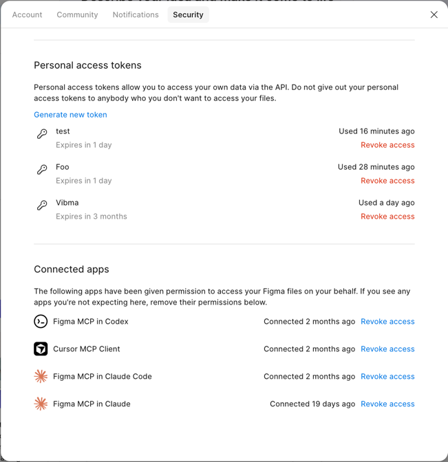
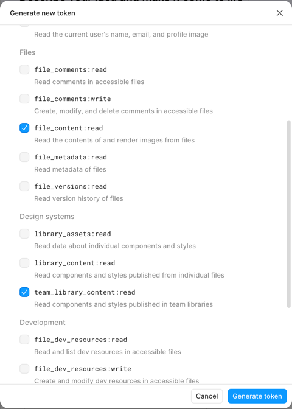
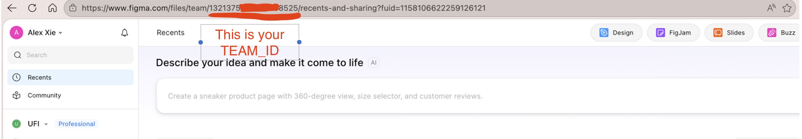

> **[English](./DRAGME.md)**

# Vibma 安装指南

> **本指南假设你已克隆仓库，并在项目根目录下执行命令。** 如果尚未克隆：
> ```bash
> git clone https://github.com/ufira-ai/vibma.git
> cd vibma
> ```
> 想要免下载的安装方式？请参阅 [CARRYME.md](./CARRYME.md)。

## 前提条件

- [Node.js](https://nodejs.org) (v18+)
- [Figma](https://figma.com) 桌面版或网页版
- 支持 MCP 的 AI 编程工具（Claude Code、Cursor 等）

## 1. 安装依赖

```bash
npm install
npm run build
```

## 2. 启动 WebSocket relay

这是 MCP server 和 Figma 插件之间通过频道通信的桥梁。所有数据都在本机运行——不会有任何数据离开 localhost。

```bash
npm run socket
```

你应该会看到：`WebSocket server running on port 3055`

### 关于端口

Vibma 默认使用端口 **3055**。Figma 插件 manifest 白名单中包含端口 **3055–3058**，如果 3055 已被占用（例如被上游 cursor-talk-to-figma-mcp 项目占用），可以使用其他端口。设置 `VIBMA_PORT` 环境变量即可使用其他端口：

```bash
VIBMA_PORT=3056 npm run socket
```

MCP server 读取同一环境变量，因此会自动匹配。你只需在 Figma 插件界面中点击 Connect 前更新**端口字段**即可。

Figma 插件只能连接到端口 3055、3056、3057 或 3058。这是 Figma 平台的限制——manifest 的 `allowedDomains` 无法在运行时更改。

## 3. 安装 Figma 插件

1. 在 Figma 中，前往 **Plugins > Development > Import plugin from manifest...**
2. 选择本仓库中的 `plugin/manifest.json`（由 `npm run build` 生成）
3. 运行插件——将显示连接面板

## 4. 在 AI 工具中配置 MCP

添加到你的 MCP 配置文件（例如 `.cursor/mcp.json`、`.claude.json` 或 `.mcp.json`）：

```json
{
  "mcpServers": {
    "Vibma": {
      "command": "node",
      "args": ["/absolute/path/to/vibma/dist/mcp.js", "--edit"]
    }
  }
}
```

或直接从源码运行（无需构建步骤，适合开发）：

```json
{
  "mcpServers": {
    "Vibma": {
      "command": "npx",
      "args": ["tsx", "/absolute/path/to/vibma/packages/core/src/mcp.ts", "--edit"]
    }
  }
}
```

> **注意：** 请将 `/absolute/path/to/vibma` 替换为你克隆仓库的实际路径。在 vibma 目录下运行 `pwd` 即可获取路径。MCP 客户端不会设置工作目录，因此相对路径无法解析。

### 访问层级

Vibma 通过访问层级控制可用工具。通过传入标志设置层级：

| 标志 | 可用工具 | 使用场景 |
|------|---------|---------|
| _(无)_ | 只读（检查、搜索、导出） | 安全浏览、审查 |
| `--create` | 只读 + 创建（frame、文本、形状） | 生成新设计 |
| `--edit` | 所有工具（只读 + 创建 + 编辑 + 删除） | 完整设计工作流 |

大多数用户需要 `--edit` 以获得完整权限。省略标志则为只读模式。

### 非默认端口

如果使用非默认端口，添加 `--port=`：

```json
{
  "mcpServers": {
    "Vibma": {
      "command": "node",
      "args": ["/absolute/path/to/vibma/dist/mcp.js", "--edit", "--port=3056"]
    }
  }
}
```

## 可选：库与图片 API 密钥

Vibma 的核心工具无需任何 API 密钥。如需启用**团队库发现**和**图库照片搜索**，请在 MCP 配置中添加环境变量：

```json
{
  "mcpServers": {
    "Vibma": {
      "command": "node",
      "args": ["/absolute/path/to/vibma/dist/mcp.js", "--edit"],
      "env": {
        "FIGMA_API_TOKEN": "<your-figma-pat>",
        "FIGMA_TEAM_ID": "<your-team-id>",
        "PEXELS_API_KEY": "<your-pexels-key>"
      }
    }
  }
}
```

### 获取 Figma 个人访问令牌

1. 前往 [Figma 设置 > 安全](https://www.figma.com/settings)，滚动到 **Personal access tokens**

   

2. 点击 **Generate new token**，勾选以下两个权限：
   - **File content — Read**（`file_content:read`）
   - **Team library content — Read**（`team_library_content:read`）

   

3. 复制生成的令牌 — 以 `figd_` 开头

### 获取 Team ID

Team ID 是 Figma 主页 URL 中的数字：

```
https://www.figma.com/files/team/1234567890/...
                                 ^^^^^^^^^^
                                 这就是你的 TEAM_ID
```



### 获取 Pexels API 密钥

1. 前往 [pexels.com/api/key](https://www.pexels.com/api/key/) 注册或登录
2. 申请 API 密钥 — 个人和商业用途均免费
3. 从控制面板复制密钥

Pexels 照片可免费使用，包括商业用途。请阅读 [Pexels 服务条款](https://www.pexels.com/terms-of-service/)，在生产环境中使用图片时请注明摄影师。Vibma 会自动将摄影师信息附加到放置的图片节点描述中。

## 5. 连接

1. 在 Figma 插件中，将频道名设置为 `vibma`（或任意你喜欢的名称）
2. 点击 **Connect**
3. 在 AI 工具中调用 `connection(method: "create")`，使用相同的频道名（默认为 `vibma`）
4. 调用 `connection(method: "get")` ——你应该会收到包含文档名称的 `pong` 响应

### 频道规则

每个频道严格限制**一个 Figma 插件和一个 MCP server**。如果第二个插件（或第二个 MCP）尝试加入已被占用的频道，将被拒绝并返回明确的错误信息。要连接不同的插件，请先断开第一个，或使用不同的频道名。

### 调试连接

使用 relay 内置的调试接口查看当前连接状态：

```bash
curl http://localhost:3055/channels
```

返回结果：
```json
{
  "vibma": {
    "mcp": { "connected": true, "version": "0.1.1", "joinedAt": "2026-02-28T12:00:00.000Z" },
    "plugin": { "connected": true, "version": "0.1.1", "joinedAt": "2026-02-28T12:00:01.000Z" }
  }
}
```

如果使用 Claude Code，`connection(method: "list")` 可以返回相同的数据，无需离开 AI 工具。

## 故障排除

**插件无法连接 WebSocket**：确保 relay 正在运行。插件默认连接到 `ws://localhost:3055`。

**插件界面显示"Connection rejected"**：另一个插件已连接到该频道。请先断开它，或使用不同的频道名。运行 `curl http://localhost:3055/channels` 查看当前连接。

**MCP 显示断开连接**：更改 MCP 配置后重启你的 AI 工具。基于 stdio 的 MCP server 无法热重载。

**端口已被占用**：参阅下方代理说明中的自动端口解析，或手动终止进程（`lsof -ti:3055 | xargs kill`）。

**版本不匹配警告**：插件和 MCP server 运行的版本不同。运行 `npm run build` 并重启两者即可解决。

---

## Instructions for AI Agents

The section below is for AI agents setting up Vibma on behalf of a user. Follow these steps in order.

### Port resolution

Before starting the socket relay, check if the default port is available:

```bash
lsof -ti:3055
```

If the port is occupied, ask the user:

> Port 3055 is already in use by another process (PID: <pid>). Would you like to:
> 1. **Kill the process** on port 3055 and use it for Vibma
> 2. **Use the next available port** (3056, 3057, or 3058)

If the user chooses option 2, scan ports in order:

```bash
lsof -ti:3056 || echo "3056 is free"
lsof -ti:3057 || echo "3057 is free"
lsof -ti:3058 || echo "3058 is free"
```

Use the first free port. Set `VIBMA_PORT=<port>` when starting the relay, and pass `--port=<port>` to the MCP server in the MCP config. Inform the user to set the same port in the Figma plugin UI before clicking Connect.

If all four ports (3055–3058) are occupied, tell the user they need to free one.

### Connection verification

After the user opens the Figma plugin, it should automatically show **Connected** on the default port (3055). If a non-default port was used, the user will need to select the correct port in the plugin UI and click Connect.

1. Call `connection(method: "create")` (defaults to channel `vibma` — use a different name only if the user specifies one).
2. Call `connection(method: "get")`. Expected response: `{ status: "pong", documentName: "...", currentPage: "...", timestamp: ... }`

If `connection(method: "get")` returns a `pong` with a document name, the full chain is verified. Proceed with design tasks.

### Troubleshooting connection issues

If the plugin shows **Disconnected** on port 3055, try the following before asking the user:

1. Check the relay is running: `lsof -ti:3055` — if no output, the relay isn't started.
2. Restart the relay: `npm run socket`
3. Ask the user to close and reopen the Figma plugin.

If `connection(method: "create")` fails with a `ROLE_OCCUPIED` error, another MCP server is already connected to that channel. Use `connection(method: "list")` (or `curl http://localhost:3055/channels`) to inspect who's connected. The user needs to disconnect the other MCP client or use a different channel name.

If the issue persists after these steps, direct the user to the [Vibma Discord](https://discord.gg/4XTedZdwV6) for help.

If any tool times out after a successful `connection(method: "create")`, the Figma plugin is not connected to the relay. The timeout error will include the port and channel the MCP server is using. Ask the user to check the Figma plugin window and confirm:
- The **port** matches what MCP is using
- The **channel name** matches what MCP joined
- The plugin status shows **Connected**

### Configuring API keys

If the user wants to use team library components or stock photos, help them set up the environment variables.

**FIGMA_API_TOKEN + FIGMA_TEAM_ID**: If the user doesn't know their Team ID, ask them to paste their Figma home page URL — it looks like `https://www.figma.com/files/team/1234567890/...`. Parse the number after `/team/` — that's the Team ID. For the PAT, walk them through Figma Settings > Security > Personal access tokens > Generate new token, and ensure they check **File content — Read** and **Team library content — Read**.

**PEXELS_API_KEY**: Direct the user to [pexels.com/api](https://www.pexels.com/api/) to create a free account and get an API key.

After updating the env vars in their MCP config, they must restart the AI tool (or reload MCP servers) for the changes to take effect.

### Version mismatch

If `connection(method: "create")` returns a version mismatch warning, the Figma plugin and MCP server are running different versions. Offer to help the user update:

1. Pull the latest changes: `git pull origin main`
2. Rebuild: `npm install && npm run build`
3. Restart the relay: kill the old process (`lsof -ti:3055 | xargs kill`), then `npm run socket`
4. Ask the user to close and reopen the Figma plugin (it auto-reloads from `plugin/`)
5. Reconnect: `connection(method: "create")` → `connection(method: "get")`

All three components (plugin, relay, MCP server) are built from the same source and should always be on the same version.
